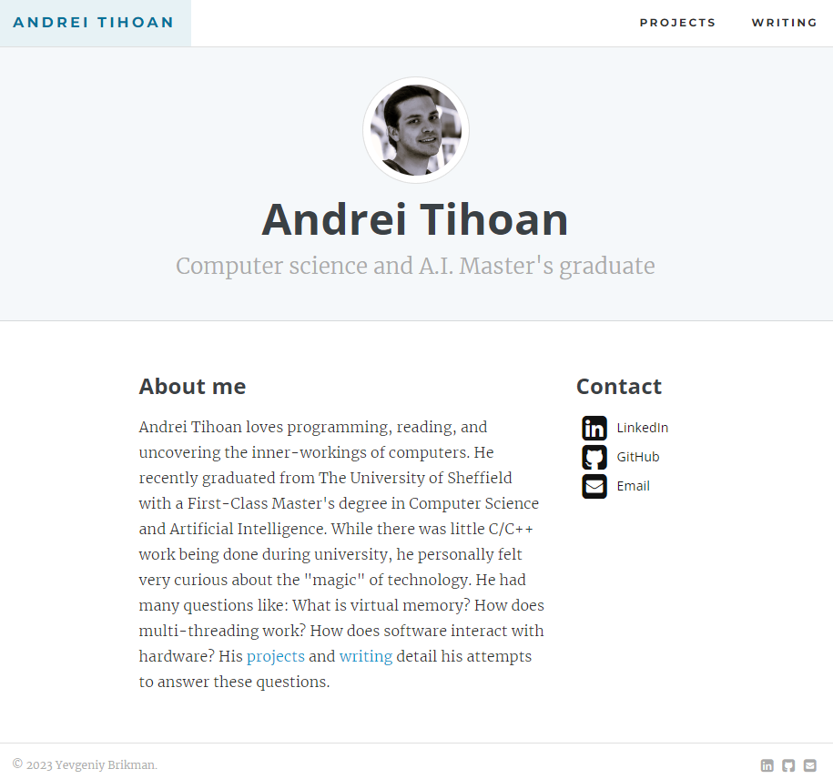

# Hi there 👋

I've been tinkering with JavaScript, HTML and CSS  recently, and have really enjoyed learning more about the web along the way. Welcome to my profile!
 
 
🌐 Web development: You can explore some of my webdev projects here.

💻 C++ Development: . You can explore some of my C++ projects here.
 
 
🤖 AI Development: In the final year of my degree, as part of a team of 4 I worked on a MultiModal Artificial Intelligence model that predicts the type of pneumonia a patient has based on 3 input modalities:
1. Image data in the form of XRays taken of a patient's lungs
2. Time-Series and
3. Static data.
- We were granted access to the [MIMIC-IV](https://physionet.org/content/mimiciv/2.2/) dataset for the project.
- Unfortunately, the code for that project is in a private repo on my university [github account](https://github.com/Gizs).

🔧 Skills: Some of the tools and technologies I work with include:
 
 

   
   
   
   
   
   
   
   
   
   
   

🔭 I’m currently working on: portfolio.fit. A SAAS page builder for professionals that want to display their work online but don't want to go through the hassle of making and hosting a personal website.
The user chooses a template and their portfolio is hosted under a personal http link.

🌱 I’m currently learning: More about modern frontend frameworks and tooling such as Angular, React and TypeScript.
 
  
## 📂 Portfolio Website:

 
 

<!--
**AndreiTih/AndreiTih** is a ✨ _special_ ✨ repository because its `README.md` (this file) appears on your GitHub profile.

Here are some ideas to get you started:

- 👯 I’m looking to collaborate on ...
- 🤔 I’m looking for help with ...
- 💬 Ask me about ...
- 📫 How to reach me: ...
- 😄 Pronouns: ...
- ⚡ Fun fact: ...
-->
